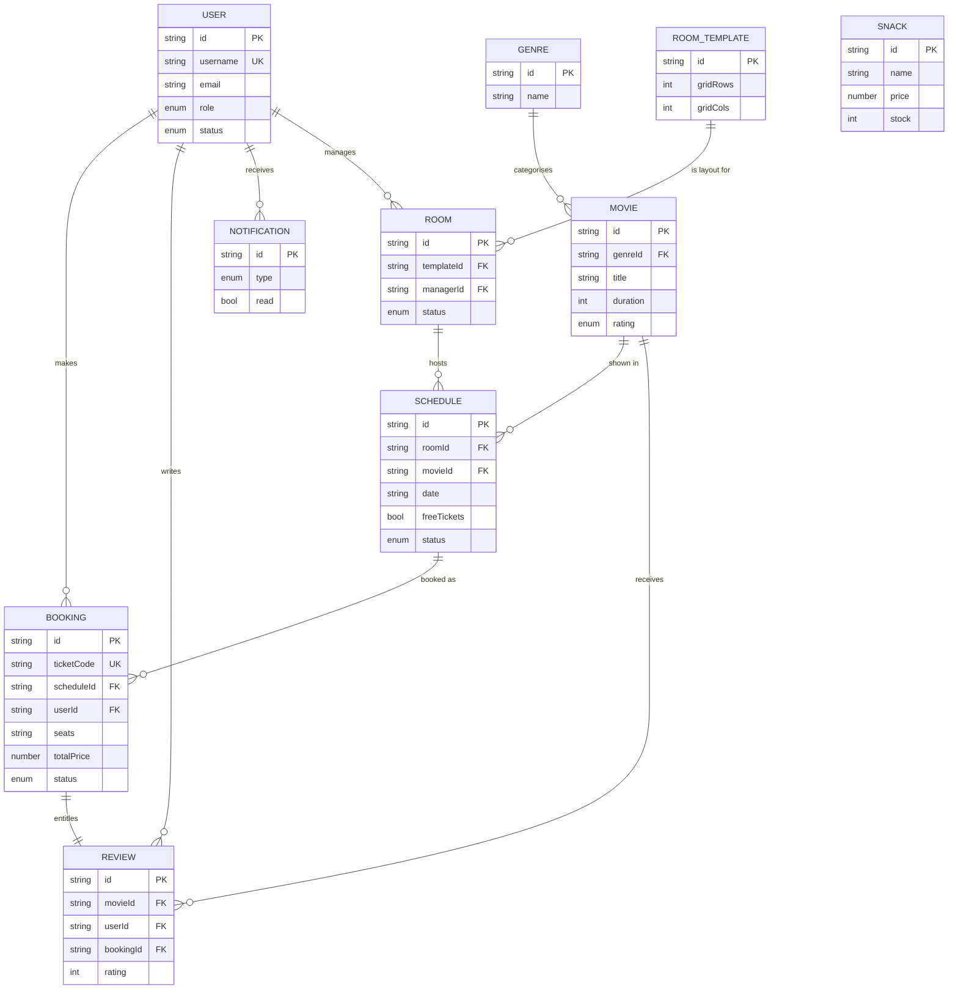

# UniCinema — Project Documentation

> A web-based cinema management and booking system built with React, TypeScript,
> and Firebase. This document explains *what* the project is, *how* it is
> structured, and *why* the code is organised the way it is — written so it can
> be used directly in a report and to help you explain the code with confidence.

---

## Table of Contents

1. [Project Overview](#1-project-overview)
2. [Technology Stack](#2-technology-stack)
3. [High-Level Architecture](#3-high-level-architecture)
4. [Folder Structure](#4-folder-structure)
5. [How the App Boots and Routes](#5-how-the-app-boots-and-routes)
6. [Authentication & Roles](#6-authentication--roles-authcontexttsx)
7. [The Data Layer — Services](#7-the-data-layer--services)
8. [CineBot — The AI Chatbot](#8-cinebot--the-ai-chatbot-geminiservicets)
9. [Notable Feature: Automated Scheduling](#9-notable-feature-automated-scheduling)
10. [Notable Feature: QR-Code Tickets](#10-notable-feature-qr-code-tickets)
11. [External APIs & Services Used](#11-external-apis--services-used)
12. [Data Classes & Entity Relationships (ERD)](#12-data-classes--entity-relationships-erd)
13. [Algorithm & Logic Flow of the System](#13-algorithm--logic-flow-of-the-system)
14. [Running the Project](#14-running-the-project)
15. [Glossary](#15-glossary-for-the-report)
16. [Suggested "How to Explain This Project" Script](#16-suggested-how-to-explain-this-project-script)

---

## 1. Project Overview

**UniCinema** is a single-page web application (SPA) that manages the full
lifecycle of a cinema: managing users, movies, cinema rooms, schedules, snacks,
and ticket bookings — including QR-code check-in and an AI chatbot assistant.

The system is built around **four user roles**, each with a tailored dashboard
and set of permissions:

| Role | Internal key | What they do |
|------|--------------|--------------|
| **Admin** | `Admin` | Top-level control: manage users, rooms, movies, snacks, and view system-wide analytics. |
| **Cinema Room (Manager)** | `Cinema Room` | Manage one cinema's day-to-day operation: schedules, staff, tickets, and analytics. |
| **Staff** | `Staff` | Front-of-house: view the day's schedule, scan tickets, and do walk-up bookings. |
| **Moviegoer** | `Moviegoer` | Public customer: browse movies, view schedules, book tickets, chat with CineBot, and view their tickets. |

### Key Features
- **Role-based access** — the interface and navigation change per role.
- **Real-time data** — powered by Firebase Realtime Database; changes appear instantly across clients.
- **Custom cinema room layouts** — managers design seat layouts using a visual template builder.
- **Automated scheduling** — auto-generate a day's showtimes from a set of constraints.
- **QR-code tickets** — bookings generate a QR code; staff scan it to check guests in.
- **AI chatbot (CineBot)** — a movie-recommendation assistant powered by Google's Gemini API.

---

## 2. Technology Stack

| Layer | Technology | Purpose |
|-------|-----------|---------|
| **UI framework** | React 18 + TypeScript | Component-based interface with static typing. |
| **Build tooling** | Create React App (`react-scripts`) | Bundling, dev server, build pipeline. |
| **Backend / Database** | Firebase Realtime Database | Stores all application data (users, movies, bookings, etc.). |
| **Authentication** | Firebase Authentication | Email/password login and session management. |
| **AI** | Google Gemini API (`gemini-2.5-flash`) | Powers the CineBot chatbot. |
| **Icons** | `lucide-react` | Icon set used throughout the UI. |
| **QR codes** | `qrcode` + `html5-qrcode` | Generating ticket QR codes and scanning them via camera. |

> **Note:** There is no custom backend server. The React app talks directly to
> Firebase. This keeps the architecture simple (good for a student project) but
> means security rules must be enforced in Firebase itself, and API keys end up
> in the client bundle (acknowledged in the code comments for the Gemini key).

---

## 3. High-Level Architecture

```
┌─────────────────────────────────────────────────────────┐
│                      React SPA (browser)                  │
│                                                           │
│   ┌──────────────┐   ┌──────────────┐   ┌─────────────┐   │
│   │  Pages (UI)  │──▶│   Services   │──▶│  Firebase   │   │
│   │  per role    │   │ (data layer) │   │ SDK config  │   │
│   └──────────────┘   └──────────────┘   └─────────────┘   │
│          ▲                                      │          │
│          │            ┌──────────────┐          │          │
│          └────────────│  Contexts    │          │          │
│                       │ (Auth/Theme) │          │          │
│                       └──────────────┘          │          │
└─────────────────────────────────────────────────┼─────────┘
                                                    │
                          ┌─────────────────────────▼──────────────────┐
                          │  Firebase  (Auth + Realtime Database)        │
                          └──────────────────────────────────────────────┘
                                                    
                          ┌──────────────────────────────────────────────┐
                          │  Google Gemini API  (CineBot chatbot)         │
                          └──────────────────────────────────────────────┘
```

The app follows a clean **separation of concerns**:

1. **Pages / Components** — what the user sees (presentation).
2. **Services** — all communication with Firebase (data access). Pages never talk to Firebase directly; they call service functions.
3. **Contexts** — shared global state (who is logged in, current theme/view).
4. **Config** — Firebase initialisation.

This layering is the single most important idea in the codebase: **UI calls
services, services call Firebase.** If you understand that, you understand the
whole app.

---

## 4. Folder Structure

```
unicinema-project/
├── public/
│   └── index.html              # HTML shell that React mounts into
├── src/
│   ├── index.tsx               # App entry point — renders <App/>
│   ├── global.d.ts             # Global TypeScript declarations
│   ├── styles/
│   │   └── global.css          # Global styles + CSS variables (colours, fonts)
│   └── app/
│       ├── App.tsx             # Root component: chooses Login vs. main layout
│       ├── routes.tsx          # Maps "view" strings to page components
│       │
│       ├── config/
│       │   └── firebase.ts     # Firebase initialisation (auth + database)
│       │
│       ├── context/
│       │   ├── AuthContext.tsx # Login state, current user role + view
│       │   └── ThemeContext.tsx# Light/dark theme
│       │
│       ├── services/           # ── DATA LAYER (all Firebase access) ──
│       │   ├── userService.ts      # Users + authentication
│       │   ├── movieService.ts     # Movies + genres
│       │   ├── templateService.ts  # Room layouts + rooms
│       │   ├── scheduleService.ts  # Showtimes + auto-scheduling
│       │   ├── bookingService.ts   # Ticket bookings + check-in
│       │   ├── snackService.ts     # Snacks / concessions
│       │   ├── reviewService.ts    # Movie reviews & ratings
│       │   ├── notificationService.ts # In-app notifications (per user)
│       │   └── geminiService.ts    # CineBot AI chatbot (Gemini API)
│       │
│       ├── pages/              # ── SCREENS, grouped by role ──
│       │   ├── Admin/          # Dashboard, Users, Rooms, Movies, Snacks, Analytics
│       │   ├── Manager/        # Dashboard, Cinema, Staff, Tickets, Analytics
│       │   ├── Staff/          # StaffIndex (schedule board + scanning)
│       │   ├── Moviegoer/      # Browse, Schedule, MyTickets, ChatbotPage
│       │   ├── Settings.tsx    # Shared settings page
│       │   └── NotFound.tsx    # Fallback for unknown views
│       │
│       ├── components/         # ── REUSABLE UI ──
│       │   ├── Layout/         # AppLayout, Sidebar, Topbar
│       │   ├── ui/             # Buttons, Cards, Modals, SeatMap, QR views, etc.
│       │   ├── RoomTemplateBuilder.tsx  # Visual seat-layout designer
│       │   ├── AutoScheduleModal.tsx    # Auto-schedule generator dialog
│       │   └── WalkupBooking.tsx        # Counter booking flow
│       │
│       ├── hooks/
│       │   └── useBookingReminders.ts # Fires "starting soon" reminders while open
│       │
│       ├── types/
│       │   └── index.ts        # Shared TypeScript interfaces
│       │
│       └── utils/
│           ├── helpers.ts      # Navigation config, role names, formatters
│           ├── icons.tsx       # Icon mapping/registry
│           ├── preferences.ts  # Per-user notification preferences (Firebase)
│           ├── mockData.ts     # Sample data
│           └── seedAdmin.ts    # One-time script to create the first admin
```

---

## 5. How the App Boots and Routes

Unlike many React apps, **UniCinema does not use a URL router** (like React
Router). Instead it uses a simple "view" string stored in `AuthContext`. This is
a lightweight approach that suits the role-based dashboard model.

### The flow

1. **`src/index.tsx`** renders `<App/>` wrapped in the `AuthProvider` and `ThemeProvider`.
2. **`App.tsx`** reads the auth state from `useAuth()`:
   - While Firebase is still checking the session → show a **loading spinner**.
   - If **not logged in** → show the **`<Login/>`** page.
   - If **logged in** → render the **`<AppLayout/>`** (sidebar + topbar) with the current page inside it.
3. The current page is resolved by **`routes.tsx`**:

```ts
// routes.tsx — maps a "view" key to a page element
const ROUTE_MAP: Record<string, ReactElement> = {
  dashboard:   <AdminDashboard />,
  users:       <UserManagement />,
  browse:      <Browse />,
  cinebot:     <ChatbotPage />,
  // ...
};

export const resolveView = (view: string): ReactElement =>
  ROUTE_MAP[view] ?? <NotFound />;   // unknown view → 404 page
```

4. The user changes the view by clicking the **sidebar**, which calls
   `setView('movies')` (from `AuthContext`). React re-renders, `resolveView`
   returns the new page, and the screen changes — no page reload.

### Navigation per role

`utils/helpers.ts` defines `NAV_CONFIG`, a per-role map of sidebar sections and
items. The sidebar simply reads the current role and renders that role's menu.
This is how each role sees a different navigation menu.

```ts
export const DEFAULT_VIEWS: Record<UserRole, string> = {
  Admin:        'dashboard',
  'Cinema Room':'dashboard',
  Staff:        'staff-main',
  Moviegoer:    'browse',
};
```

When a user logs in, they land on their role's default view.

---

## 6. Authentication & Roles (`AuthContext.tsx`)

`AuthContext` is the **single source of truth** for "who is logged in and what
can they see." Every component can read it via the `useAuth()` hook.

### What it tracks
- `isLoggedIn` / `isLoading` — session state.
- `role` — the **effective** role currently being used.
- `actualRole` — the user's **real** role (Admins can temporarily switch role to preview other dashboards via `switchRole`).
- `uid` — the Firebase user ID.
- `currentView` — which page is shown.
- `error` — login error message.

### How session restore works

On app load, `onAuthStateChanged` (Firebase) fires. If Firebase remembers a
logged-in user, the app looks up that user's role in the database and restores
their session — so a page refresh doesn't log you out:

```ts
useEffect(() => {
  const unsubscribe = onAuthStateChanged(auth, async (firebaseUser) => {
    if (firebaseUser) {
      const userRole = await getCurrentUserRole(firebaseUser.uid);
      // ...set role, uid, default view, mark logged in
    } else {
      setIsLoggedIn(false);
    }
    setIsLoading(false);
  });
  return () => unsubscribe();   // clean up listener on unmount
}, []);
```

### Login

`login()` calls `loginUser()` from the user service, then sets the role and
default view. Firebase error codes are translated into friendly messages
(e.g. `auth/invalid-credential` → "Invalid email or password").

---

## 7. The Data Layer — Services

This is the heart of the application. Every service file follows the **same
consistent pattern**, which makes the codebase easy to learn — learn one
service and you understand them all.

### The common pattern

Each service typically contains:

1. **Type definitions** — the shape of the data (e.g. `Booking`, `Movie`).
2. **Database references** — small helpers pointing at a path, e.g.
   `const bookingsRef = () => ref(db, 'bookings');`
3. **CRUD functions** — Create, Read, Update, Delete operations.
4. **Real-time subscriptions** — `subscribeToX(callback)` functions that listen
   for live changes and call back whenever data updates.

```ts
// The "subscribe" pattern, identical across every service:
export const subscribeToMovies = (callback: (movies: Movie[]) => void) => {
  const dbRef = moviesRef();
  onValue(dbRef, (snap) => {                       // fires on every change
    if (!snap.exists()) { callback([]); return; }
    callback(Object.values(snap.val()) as Movie[]);
  });
  return () => off(dbRef);                          // returns an "unsubscribe"
};
```

In a component you use it like this, and React keeps the UI in sync with the
database automatically:

```ts
useEffect(() => {
  const unsubscribe = subscribeToMovies(setMovies);
  return unsubscribe;   // stop listening when the component unmounts
}, []);
```

### Service-by-service summary

#### `userService.ts` — Users & Authentication
- `loginUser` / `logoutUser` — Firebase auth wrappers.
- `createUser` — **clever detail:** to create a new user, an Admin would
  normally get *signed in as that new user* by Firebase. To avoid this, the code
  spins up a **secondary Firebase app instance**, creates the user there, then
  deletes the secondary app — keeping the admin's own session intact.
- `registerMoviegoer` — public self-registration (always creates a `Moviegoer`).
- **Username uniqueness** — usernames are tracked in a separate `/usernames`
  index (`username → uid`) so they can be checked and "claimed" atomically.
- `changePassword` — re-authenticates before changing the password (a Firebase requirement).

#### `movieService.ts` — Movies & Genres
- CRUD for **movies** and **genres** (genres carry a default emoji + colour used as a "poster").
- `CONTENT_RATINGS` — the U / PG / 18 / etc. classification list.
- `seedDefaultGenres` — populates 10 starter genres on first run.

#### `templateService.ts` — Room Layouts & Rooms
- A **`RoomTemplate`** describes a seat layout as a grid of *sections*, each
  section being its own grid of seats. Keys like `"r0c1"` locate a section in
  the layout. `templateSeatCount` totals up all the seats.
- A **`Room`** is a physical cinema linked to a template and (optionally) a manager.

#### `scheduleService.ts` — Showtimes & Auto-Scheduling
- Defines a **`Schedule`** (a showing of a movie in a room at a date/time).
- **Clash detection** (`findClash`) — converts times to minutes and checks for
  overlaps so two shows can't be booked in the same room at the same time.
- **`autoStatus`** — derives `upcoming` / `running` / `completed` from the
  current time.
- **`generateAutoSchedule`** — a *pure function* that builds a whole day's
  worth of showtimes from constraints (movies, dates, day start/end, gap,
  repeats). It packs shows back-to-back, alternates movies round-robin, and
  drops any show that would run past the day's end. (See §9.)

#### `bookingService.ts` — Ticket Bookings
- A **`Booking`** records who booked which seats for which showing, the price,
  payment, and status (`confirmed` / `checked-in` / `cancelled`).
- `generateTicketCode` — produces a human-readable code like `TKT-7KQ2MA`
  (ambiguous characters like `0`/`O`, `1`/`I` are deliberately excluded).
- `getBookedSeats` — returns taken seats for a showing so the seat map can grey them out.
- `checkInBooking` — marks a ticket as checked-in (used by the QR scanner).
- Multiple `subscribeTo…` variants (all / by room / by user / by schedule).

#### `snackService.ts` — Concessions
- CRUD plus `restockSnack` (adds to stock) and a `seedDefaultSnacks` starter set.
- Snacks have categories (Food, Beverage, Combo, …) and an `available` toggle.

#### `reviewService.ts` — Reviews & Ratings
- Moviegoers leave a 1–5 star rating + comment, tied to a booking (you must have
  booked the movie to review it).
- `getMovieAverageRating` computes the average shown on movie cards.

#### `notificationService.ts` — In-app Notifications
- Per-user notifications stored at `/notifications/{userId}`, each with a
  `type` (booking / cancel / reminder / movie / promo / system), title, message,
  `read` flag and timestamp.
- `createNotification` — push a notification to one user (fire-and-forget; failures
  are swallowed so they never break the action that triggered them).
- `broadcastPromoToMoviegoers` — send a promotional notification (e.g. "new movie
  added") to every Moviegoer who has opted in via their notification preferences.
- `subscribeToUserNotifications` / `markNotificationRead` / `markAllNotificationsRead`
  power the live bell-dropdown in the Topbar (unread count badge + mark-as-read).
- **Triggers:** booking confirmed (Browse + walk-up), booking cancelled (My Tickets),
  new movie added (Movie Management), and "starting soon" reminders (see below).
- **Preferences** live at `/notificationPrefs/{userId}` (`utils/preferences.ts`) and
  gate which notifications a user receives; they are edited on the Settings page.

#### `geminiService.ts` — CineBot AI (see §8)

---

## 8. CineBot — The AI Chatbot (`geminiService.ts`)

CineBot is a movie-recommendation assistant. The service `askCineBot()` sends
the conversation to Google's **Gemini** model and returns a **structured**
reply.

Key design points worth highlighting in a report:

- **Structured output** — instead of free text, Gemini is asked (via
  `responseSchema`) to return JSON with three fields:
  ```ts
  interface CineBotReply {
    reply:       string;    // the message to show the user
    movieTitles: string[];  // catalogue movies to display as cards
    suggestions: string[];  // quick-reply chips
  }
  ```
  This lets the UI render movie cards and tappable suggestions, not just text.
- **Retry with back-off** — if Gemini returns `503` (overloaded) or `429`
  (rate-limited), the code retries up to 3 times with an increasing delay.
- **Graceful errors** — a custom `GeminiError` carries user-friendly messages
  (e.g. "CineBot's brain is a little overloaded right now").
- **API key** — read from `REACT_APP_GEMINI_API_KEY` in `.env`. The code
  comments honestly note that, as a Create-React-App env var, the key is bundled
  into the client and a production app would proxy this through a backend.

---

## 9. Notable Feature: Automated Scheduling

`generateAutoSchedule` (in `scheduleService.ts`) is a good example to discuss in
a report because it is a **pure, testable algorithm** with no side effects.

**Input:** a config (room, movie list, dates, day start/end, gap, repeats per
day) and the movies' durations.
**Output:** a list of schedule payloads — but it does **not** write to the
database itself.

The algorithm:
1. Build a **round-robin playlist** — with movies `[A, B, C]` and 2 repeats it
   produces `A B C A B C`, so movies alternate rather than playing twice in a row.
2. Starting at `dayStart`, place each movie back-to-back, adding the configured
   gap after each.
3. If a show would end after `dayEnd`, stop for that day.
4. Repeat per selected date.

Keeping generation (pure logic) separate from writing (database side-effects)
makes the feature easier to reason about and test.

---

## 10. Notable Feature: QR-Code Tickets

- When a booking is made, it gets a unique `ticketCode`.
- On the moviegoer's ticket (`QrCodeView.tsx`), the `qrcode` library renders
  that code as a scannable QR image.
- Staff use `QrScanner.tsx` (built on `html5-qrcode`) to scan a ticket with the
  device camera. The scanned code is looked up via `findBookingByCode`, and
  `checkInBooking` flips its status to `checked-in`.

This gives a realistic end-to-end ticketing flow: **book → QR code → scan →
checked in.**

---

## 11. External APIs & Services Used

The app has **no custom backend**. Everything is reached directly from the
browser through three external APIs plus a couple of browser APIs.

### 11.1 Firebase Authentication API
Used in `userService.ts` and `AuthContext.tsx` for all account/session logic.

| Function (Firebase SDK) | Where / why it's used |
|-------------------------|------------------------|
| `signInWithEmailAndPassword` | `loginUser` — log a user in. |
| `signOut` | `logoutUser` — end the session. |
| `createUserWithEmailAndPassword` | `createUser` / `registerMoviegoer` — make new accounts. |
| `onAuthStateChanged` | `AuthContext` — restore session on refresh. |
| `updatePassword` + `reauthenticateWithCredential` + `EmailAuthProvider` | `changePassword` — Firebase requires re-auth before a password change. |
| `initializeApp` / `deleteApp` (secondary app) | `createUser` — create a user without disturbing the admin's session. |

### 11.2 Firebase Realtime Database API
Every service file uses the same small set of SDK functions. This is the entire
database "vocabulary" of the project:

| Function | Purpose |
|----------|---------|
| `ref(db, 'path')` | Point at a location in the JSON tree. |
| `push(ref)` | Create a new child with an auto-generated **push ID**. |
| `set(ref, value)` | Write/overwrite data at a location. |
| `update(ref, partial)` | Patch specific fields without overwriting siblings. |
| `get(ref)` | Read once (one-off fetch). |
| `remove(ref)` | Delete data. |
| `onValue(ref, cb)` / `off(ref)` | Subscribe / unsubscribe to **real-time** changes. |

### 11.3 Google Gemini API (CineBot)
A REST call (not an SDK) in `geminiService.ts`:

- **Endpoint:** `POST https://generativelanguage.googleapis.com/v1beta/models/{model}:generateContent?key=…`
- **Model:** `gemini-2.5-flash`
- **Auth:** API key from `REACT_APP_GEMINI_API_KEY`.
- **Request highlights:** a `system_instruction` (CineBot's persona + the live
  movie catalogue), the chat `contents` (history), and a `generationConfig` that
  forces **JSON output** via `responseMimeType: 'application/json'` and a
  `responseSchema`.
- **Transport:** the browser `fetch` API, with a 3-attempt retry on `429`/`503`.

### 11.4 Browser APIs
- **Camera / MediaDevices** — used indirectly through `html5-qrcode` in
  `QrScanner.tsx` to read ticket QR codes from the device camera.
- **Canvas** — `qrcode` renders the ticket QR image to a canvas/data-URL.
- **`localStorage`** — theme preference (`ThemeContext`) and notification prefs caching.

---

## 12. Data Classes & Entity Relationships (ERD)

All data classes are TypeScript `interface`s declared inside their service file.
They double as both the **database schema** and the **app's type system**.

### 12.1 The data classes (entities)

| Entity | Key fields | Defined in |
|--------|-----------|------------|
| **User** | `id, name, displayName, username, email, role, status, joined` | `types/index.ts` |
| **Genre** | `id, name, emoji, color` | `movieService.ts` |
| **Movie** | `id, title, genreId →Genre, duration, year, rating, synopsis, director, cast, emoji, color, createdBy` | `movieService.ts` |
| **RoomTemplate** | `id, name, gridRows, gridCols, sections{}, createdBy` | `templateService.ts` |
| **Room** | `id, name, templateId →RoomTemplate, status, managerId →User` | `templateService.ts` |
| **Schedule** | `id, roomId →Room, movieId →Movie, date, startTime, endTime, freeTickets, status, createdBy` | `scheduleService.ts` |
| **Booking** | `id, ticketCode, scheduleId →Schedule, roomId, movieId, userId →User, seats[], totalPrice, isFree, status, bookedAt` | `bookingService.ts` |
| **Snack** | `id, name, category, price, stock, emoji, description, available` | `snackService.ts` |
| **Review** | `id, movieId →Movie, userId →User, rating, comment, bookingId →Booking, createdAt` | `reviewService.ts` |
| **AppNotification** | `id, type, title, message, read, createdAt` (stored per user) | `notificationService.ts` |

> The `→` arrows mark foreign-key-style references. Because the Realtime
> Database is a flat JSON tree, these "joins" are resolved **in code** (e.g. a
> schedule stores a `movieId`, and the UI looks up the matching `Movie`).

### 12.2 Entity-Relationship Diagram

> Rendered with **Mermaid** — GitHub (and most Markdown viewers) display this as
> a real diagram. `||--o{` means *one-to-many*; `||--||` means *one-to-one*.



> **Note:** `SNACK` is intentionally standalone — it has no relationships to the
> other entities (it's a simple concession catalogue).

**Relationship summary (cardinality):**
- A **Genre** has many **Movies**; each Movie belongs to one Genre.
- A **RoomTemplate** can be used by many **Rooms**; each Room uses one template.
- A **Room** + a **Movie** combine into many **Schedules** (showtimes).
- A **Schedule** has many **Bookings**; each Booking is for one Schedule.
- A **User** makes many **Bookings** and writes many **Reviews**.
- A **Review** links one User + one Movie + the Booking that entitles it.
- A **User** receives many **AppNotifications**.
- **Snacks** are a standalone catalogue (no hard relationships).

### 12.3 Firebase storage paths

| Path | Stores | Defined in |
|------|--------|-----------|
| `/users` | User profiles | `userService.ts` |
| `/usernames` | `username → uid` uniqueness index | `userService.ts` |
| `/genres` | Movie genres + default poster style | `movieService.ts` |
| `/movies` | Movie catalogue | `movieService.ts` |
| `/templates` | Reusable seat-layout templates | `templateService.ts` |
| `/rooms` | Physical cinema rooms | `templateService.ts` |
| `/schedules` | Showtimes | `scheduleService.ts` |
| `/bookings` | Ticket bookings | `bookingService.ts` |
| `/snacks` | Concession items | `snackService.ts` |
| `/reviews` | Movie reviews & ratings | `reviewService.ts` |
| `/notifications/{uid}` | Per-user in-app notifications | `notificationService.ts` |
| `/notificationPrefs/{uid}` | Per-user notification opt-ins | `utils/preferences.ts` |

---

## 13. Algorithm & Logic Flow of the System

This section traces the **main flows** end to end — useful for a "system design"
chapter of a report.

### 13.1 Startup & authentication flow

```
index.tsx renders <App/> inside <ThemeProvider><AuthProvider>
        │
        ▼
AuthProvider runs onAuthStateChanged (Firebase)
        │
   ┌────┴─────────────────────────────┐
   │ session exists?                   │
   ▼ yes                               ▼ no
look up role in /users           isLoggedIn = false
set role + default view                │
isLoggedIn = true                      │
   └──────────────┬────────────────────┘
                  ▼
            App.tsx renders:
   isLoading → spinner
   !isLoggedIn → <Login/>
   logged in → <AppLayout> + resolveView(currentView)
```

### 13.2 View navigation (instead of a URL router)
1. User clicks a sidebar item → `setView('movies')` updates `currentView` in `AuthContext`.
2. React re-renders `App` → `resolveView('movies')` looks up `ROUTE_MAP`.
3. The matching page element renders; unknown keys fall back to `<NotFound/>`.

### 13.3 Moviegoer booking flow (the core transaction)

```
Browse / Schedule page
   │ pick a showtime  ──────────────► subscribeToAllSchedules (live data)
   ▼
Open SeatMap modal
   │ getBookedSeats(scheduleId) ─────► grey out already-taken seats
   │ user selects seats
   ▼
Free show?  ── yes ──► skip payment
   │ no
   ▼
PaymentModal (demo)  → totalPrice = seats × SEAT_PRICE (RM 10)
   ▼
createBooking(payload)
   ├─ push() generates booking id
   ├─ generateTicketCode() → "TKT-XXXXXX"
   └─ set() writes to /bookings
   ▼
createNotification(uid, "booking confirmed")   (fire-and-forget)
   ▼
Ticket appears in "My Tickets" with a QR code (live via subscribeToUserBookings)
```

### 13.4 Staff check-in flow

```
Staff opens QrScanner (camera)
   ▼
scan QR → ticketCode string
   ▼
findBookingByCode(code)  → scans /bookings for a matching, non-cancelled code
   ├─ not found → show error
   └─ found → checkInBooking(id): status = 'checked-in', set checkedInAt
   ▼
Seat map / list updates live (subscribeToRoomBookings)
```

### 13.5 Clash detection algorithm (`findClash`)
When a manager adds a schedule, the system prevents two shows overlapping in the
same room on the same day:

```
newStart, newEnd  = times converted to minutes since midnight
for each existing show in the same room + date (excluding self):
    if newStart < existing.end  AND  newEnd > existing.start:
        → OVERLAP — reject (return the clashing show)
return null   (no clash → allow)
```
The condition is the classic **interval-overlap test**: two ranges overlap iff
each starts before the other ends.

### 13.6 Auto-schedule generation algorithm (`generateAutoSchedule`)
A **pure function** (no database writes) that fills a day with showtimes:

```
playlist = round-robin of movieIds, repeated `repeatPerDay` times
           e.g. [A,B,C] ×2 → A B C A B C
for each selected date:
    cursor = dayStart (in minutes)
    for each movieId in playlist:
        end = cursor + movie.duration
        if end > dayEnd: break          # no room left today
        emit schedule {start: cursor, end}
        cursor = end + gapMinutes        # gap before next show
```
The result is a list of `SchedulePayload`s; the caller runs clash detection and
writes them. (See also §9.)

### 13.7 CineBot conversation flow (`askCineBot`)

```
ChatbotPage builds a system prompt = persona + LIVE movie catalogue
   (so the AI can only recommend movies that actually exist)
   ▼
askCineBot(systemPrompt, history)
   ▼
POST to Gemini with responseSchema → forces JSON {reply, movieTitles, suggestions}
   ├─ 429/503 → retry up to 3× with back-off
   └─ ok → parse JSON
   ▼
UI renders: reply text + movie cards (matched by title) + quick-reply chips
```

### 13.8 Real-time update pattern (used everywhere)
Every list screen follows the same loop, so the UI always mirrors the database:

```
component mounts → subscribeToX(setState)   (onValue listener attached)
database changes anywhere → callback fires → setState → React re-renders
component unmounts → returned unsubscribe() runs → off() detaches listener
```

---

## 14. Running the Project

```bash
# 1. Install dependencies
npm install

# 2. Create a .env file from the template and fill in your keys
#    cp .env.example .env   (then edit it)
#    Needs REACT_APP_GEMINI_API_KEY and the REACT_APP_FIREBASE_* values.

# 3. Start the development server (http://localhost:3000)
npm start

# 4. Build for production
npm run build
```

### First-time setup: creating the first admin
There is no admin in a fresh database. `utils/seedAdmin.ts` is a one-time helper:
temporarily call `runSeedAdmin()` from `index.tsx`, run the app once to create
the admin account, then remove the call. After that, all other users are created
through the Admin UI.

---

## 15. Glossary (for the report)

| Term | Meaning |
|------|---------|
| **SPA** | Single-Page Application — the whole app runs on one HTML page; "navigation" swaps components instead of loading new pages. |
| **Context (React)** | A way to share state (like the logged-in user) across many components without passing props down manually. |
| **Service** | A module that wraps all database/API calls for one area of the app, keeping data logic out of the UI. |
| **CRUD** | Create, Read, Update, Delete — the four basic data operations. |
| **Subscription / real-time listener** | Code that listens for database changes and updates the UI automatically. |
| **Pure function** | A function whose output depends only on its inputs and which has no side effects (e.g. `generateAutoSchedule`). |
| **Push ID** | The unique auto-generated key Firebase creates for each new record. |

---

## 16. Suggested "How to Explain This Project" Script

If you need to summarise the project verbally:

> "UniCinema is a React + TypeScript single-page app backed by Firebase. It
> supports four roles — Admin, Manager, Staff, and Moviegoer — each with its own
> dashboard. The architecture cleanly separates the UI (pages and components)
> from the data layer (services), where every service wraps Firebase CRUD and
> real-time listeners following the same pattern. Login state and the current
> role live in a React Context, and a lightweight view-string system in
> `routes.tsx` decides which page to show instead of a URL router. Standout
> features are the visual room-layout builder, an automated showtime generator,
> QR-code ticket check-in, and an AI chatbot (CineBot) powered by the Gemini
> API."

---

*This document was generated from the source code as of June 2026. If the code
changes, update the relevant section so the report stays accurate.*
