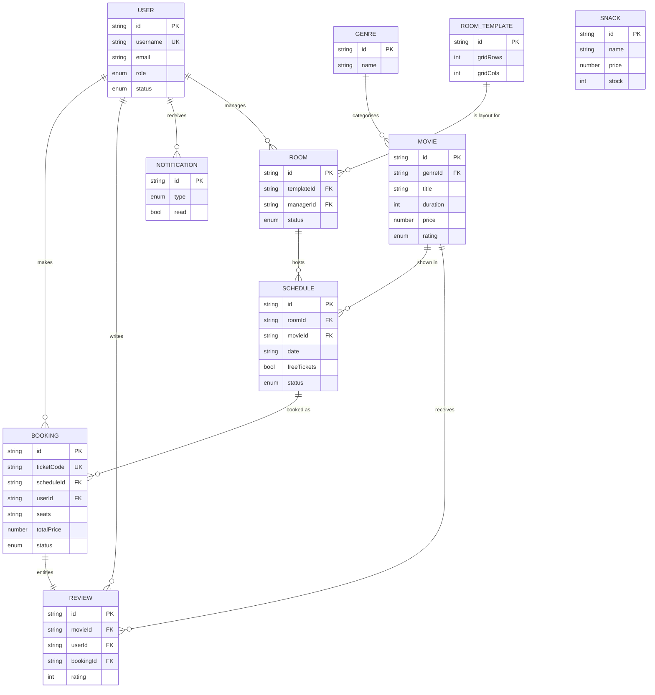

# UniCinema — Technical Documentation

> A web-based cinema management and booking system built with React, TypeScript,
> and Firebase. This document describes the system's purpose, architecture, data
> model, external integrations, and the algorithms behind its core workflows.

---

## Table of Contents

1. [Project Overview](#1-project-overview)
2. [Technology Stack](#2-technology-stack)
3. [High-Level Architecture](#3-high-level-architecture)
4. [Folder Structure](#4-folder-structure)
5. [Application Bootstrap and Routing](#5-application-bootstrap-and-routing)
6. [Authentication and Roles](#6-authentication-and-roles-authcontexttsx)
7. [The Data Layer — Services](#7-the-data-layer--services)
8. [CineBot — AI Chatbot Integration](#8-cinebot--ai-chatbot-integration-geminiservicets)
9. [Feature: Automated Scheduling](#9-feature-automated-scheduling)
10. [Feature: QR-Code Tickets](#10-feature-qr-code-tickets)
11. [Feature: Movie Performance and Review Insights](#11-feature-movie-performance-and-review-insights)
12. [External APIs and Services](#12-external-apis-and-services)
13. [Data Model and Entity Relationships (ERD)](#13-data-model-and-entity-relationships-erd)
14. [System Logic and Algorithms](#14-system-logic-and-algorithms)
15. [Running the Project](#15-running-the-project)
16. [Glossary](#16-glossary)
17. [Summary](#17-summary)

---

## 1. Project Overview

UniCinema is a single-page web application (SPA) that manages the operational
lifecycle of a cinema: users, movies, cinema rooms, showtime schedules, snacks,
and ticket bookings — including QR-code check-in and an AI-assisted movie
recommendation chatbot.

The system is organised around **four user roles**, each with a dedicated
dashboard and permission scope:

| Role | Internal key | Responsibilities |
|------|--------------|------------------|
| **Admin** | `Admin` | System-wide administration: users, rooms, movies, snacks, and analytics. |
| **Cinema Room (Manager)** | `Cinema Room` | Per-cinema operations: schedules, staff, tickets, and analytics. |
| **Staff** | `Staff` | Front-of-house operations: daily schedule, ticket scanning, and walk-up bookings. |
| **Moviegoer** | `Moviegoer` | Customer-facing: browse movies, view schedules, book tickets, use CineBot, and manage tickets. |

### Key Features
- **Role-based access** — interface and navigation are determined by the authenticated user's role.
- **Real-time data** — Firebase Realtime Database propagates changes to all connected clients without polling.
- **Configurable room layouts** — managers design seat layouts through a visual template builder.
- **Automated scheduling** — showtimes are generated from a set of operational constraints.
- **QR-code tickets** — each booking produces a QR code that staff scan for check-in.
- **AI chatbot (CineBot)** — a movie-recommendation assistant backed by the Google Gemini API.
- **Per-movie ticket pricing** — each movie carries its own editable seat price.
- **Performance and review insights** — a dedicated module aggregates attendance and ratings into stats, trend charts, and downloadable PDF reports.

---

## 2. Technology Stack

| Layer | Technology | Purpose |
|-------|-----------|---------|
| **UI framework** | React 18 + TypeScript | Component-based UI with static typing. |
| **Build tooling** | Create React App (`react-scripts`) | Bundling, development server, and build pipeline. |
| **Database** | Firebase Realtime Database | Persistence for all application data. |
| **Authentication** | Firebase Authentication | Email/password authentication and session management. |
| **AI** | Google Gemini API (`gemini-2.5-flash`) | Backs the CineBot chatbot. |
| **Icons** | `lucide-react` | Icon set used across the UI. |
| **QR codes** | `qrcode` + `html5-qrcode` | Ticket QR generation and camera-based scanning. |
| **PDF reports** | `jspdf` + `jspdf-autotable` | Client-side generation of movie performance reports. |

> **Architectural note:** The application has no dedicated backend server; the
> React client communicates directly with Firebase. This reduces operational
> complexity, but shifts two responsibilities onto configuration: access control
> must be enforced through Firebase Security Rules, and any client-side API key
> (such as the Gemini key) is included in the JavaScript bundle. The trade-offs
> are documented in the relevant sections below.

---

## 3. High-Level Architecture

```
┌─────────────────────────────────────────────────────────┐
│                      React SPA (browser)                  │
│                                                           │
│   ┌──────────────┐   ┌──────────────┐   ┌─────────────┐   │
│   │  Pages (UI)  │──▶│   Services   │──▶│  Firebase   │   │
│   │  per role    │   │ (data layer) │   │ SDK config  │   │
│   └──────────────┘   └──────────────┘   └─────────────┘   │
│          ▲                                      │          │
│          │            ┌──────────────┐          │          │
│          └────────────│  Contexts    │          │          │
│                       │ (Auth/Theme) │          │          │
│                       └──────────────┘          │          │
└─────────────────────────────────────────────────┼─────────┘
                                                    │
                          ┌─────────────────────────▼──────────────────┐
                          │  Firebase  (Auth + Realtime Database)        │
                          └──────────────────────────────────────────────┘
                                                    
                          ┌──────────────────────────────────────────────┐
                          │  Google Gemini API  (CineBot chatbot)         │
                          └──────────────────────────────────────────────┘
```

The codebase enforces a clear **separation of concerns**:

1. **Pages / Components** — presentation layer.
2. **Services** — data access layer. All Firebase communication is encapsulated here; pages never call Firebase directly.
3. **Contexts** — shared global state (authentication, theme, active view).
4. **Config** — Firebase initialisation.

The central architectural principle is unidirectional dependency: **UI depends
on services; services depend on Firebase.** This boundary keeps data-access logic
out of components and makes each layer independently testable.

---

## 4. Folder Structure

```
unicinema-project/
├── public/
│   └── index.html              # HTML shell that React mounts into
├── src/
│   ├── index.tsx               # Application entry point — renders <App/>
│   ├── global.d.ts             # Global TypeScript declarations
│   ├── styles/
│   │   └── global.css          # Global styles + CSS variables (colours, fonts)
│   └── app/
│       ├── App.tsx             # Root component: selects Login vs. main layout
│       ├── routes.tsx          # Maps "view" strings to page components
│       │
│       ├── config/
│       │   └── firebase.ts     # Firebase initialisation (auth + database)
│       │
│       ├── context/
│       │   ├── AuthContext.tsx # Authentication state, active role and view
│       │   └── ThemeContext.tsx# Light/dark theme
│       │
│       ├── services/           # ── DATA LAYER (all Firebase access) ──
│       │   ├── userService.ts        # Users + authentication
│       │   ├── movieService.ts       # Movies + genres
│       │   ├── templateService.ts    # Room layouts + rooms
│       │   ├── scheduleService.ts    # Showtimes + auto-scheduling
│       │   ├── bookingService.ts     # Ticket bookings + check-in
│       │   ├── snackService.ts       # Snacks / concessions
│       │   ├── reviewService.ts      # Movie reviews & ratings
│       │   ├── notificationService.ts# In-app notifications (per user)
│       │   └── geminiService.ts      # CineBot AI chatbot (Gemini API)
│       │
│       ├── pages/              # ── SCREENS, grouped by role ──
│       │   ├── Admin/          # Dashboard, Users, Rooms, Movies, Snacks, Analytics
│       │   ├── Manager/        # Dashboard, Cinema, Staff, Tickets, Analytics
│       │   ├── Staff/          # StaffIndex (schedule board + scanning)
│       │   ├── Moviegoer/      # Browse, Schedule, MyTickets, ChatbotPage
│       │   ├── MovieReviews/   # Performance & review insights (Admin + Manager)
│       │   ├── Settings.tsx    # Shared settings page
│       │   └── NotFound.tsx    # Fallback for unknown views
│       │
│       ├── components/         # ── REUSABLE UI ──
│       │   ├── Layout/         # AppLayout, Sidebar, Topbar
│       │   ├── ui/             # Buttons, Cards, Modals, SeatMap, QR views, BarChart, LineChart, etc.
│       │   ├── RoomTemplateBuilder.tsx  # Visual seat-layout designer
│       │   ├── AutoScheduleModal.tsx    # Auto-schedule generator dialog
│       │   ├── PaymentModal.tsx         # Demo payment dialog (paid bookings)
│       │   └── WalkupBooking.tsx        # Counter booking flow
│       │
│       ├── hooks/
│       │   └── useBookingReminders.ts # Emits "starting soon" reminders while open
│       │
│       ├── types/
│       │   └── index.ts        # Shared TypeScript interfaces
│       │
│       └── utils/
│           ├── helpers.ts          # Navigation config, role names, formatters
│           ├── icons.tsx           # Icon mapping/registry
│           ├── preferences.ts      # Per-user notification preferences (Firebase)
│           ├── reviewAnalytics.ts  # Pure attendance/rating stats + time series
│           ├── reviewReport.ts     # PDF ranking-report generation (jsPDF)
│           ├── mockData.ts         # Sample data
│           └── seedAdmin.ts        # One-time script to create the first admin
```

---

## 5. Application Bootstrap and Routing

UniCinema does not use a URL router (such as React Router). Navigation is driven
by a single `view` string held in `AuthContext`. This is a deliberate choice that
fits the role-based, dashboard-oriented model, where deep linking is not a
requirement.

### Bootstrap sequence

1. `src/index.tsx` renders `<App/>` wrapped in `AuthProvider` and `ThemeProvider`.
2. `App.tsx` reads authentication state via `useAuth()`:
   - While Firebase resolves the session → render a loading indicator.
   - If unauthenticated → render `<Login/>`.
   - If authenticated → render `<AppLayout/>` (sidebar + topbar) with the active page.
3. The active page is resolved by `routes.tsx`:

```ts
// routes.tsx — maps a "view" key to a page element
const ROUTE_MAP: Record<string, ReactElement> = {
  dashboard:   <AdminDashboard />,
  users:       <UserManagement />,
  browse:      <Browse />,
  cinebot:     <ChatbotPage />,
  // ...
};

export const resolveView = (view: string): ReactElement =>
  ROUTE_MAP[view] ?? <NotFound />;   // unknown view → fallback page
```

4. Navigation occurs when the sidebar calls `setView('movies')` on `AuthContext`.
   React re-renders, `resolveView` returns the corresponding page, and the view
   changes without a full page reload.

### Per-role navigation

`utils/helpers.ts` defines `NAV_CONFIG`, a per-role map of sidebar sections and
items. The sidebar renders the menu for the current role, which is how each role
is presented with a distinct navigation set.

```ts
export const DEFAULT_VIEWS: Record<UserRole, string> = {
  Admin:        'dashboard',
  'Cinema Room':'dashboard',
  Staff:        'staff-main',
  Moviegoer:    'browse',
};
```

On successful login, each user is routed to their role's default view.

---

## 6. Authentication and Roles (`AuthContext.tsx`)

`AuthContext` is the single source of truth for authentication state and access
scope. Any component can consume it through the `useAuth()` hook.

### State exposed
- `isLoggedIn` / `isLoading` — session status.
- `role` — the **effective** role in use.
- `actualRole` — the user's **real** role. Admins may temporarily switch the
  effective role via `switchRole` to preview other dashboards.
- `uid` — the Firebase user ID.
- `currentView` — the active page key.
- `error` — the most recent authentication error message.

### Session restoration

On load, `onAuthStateChanged` resolves any persisted Firebase session. If a user
is present, the application reads their role from the database and rehydrates the
session, so a page refresh does not force re-authentication:

```ts
useEffect(() => {
  const unsubscribe = onAuthStateChanged(auth, async (firebaseUser) => {
    if (firebaseUser) {
      const userRole = await getCurrentUserRole(firebaseUser.uid);
      // set role, uid, default view, and mark the session active
    } else {
      setIsLoggedIn(false);
    }
    setIsLoading(false);
  });
  return () => unsubscribe();   // detach the listener on unmount
}, []);
```

### Login

`login()` delegates to `loginUser()` in the user service, then sets the role and
default view. Firebase error codes are mapped to user-facing messages
(e.g. `auth/invalid-credential` → "Invalid email or password").

---

## 7. The Data Layer — Services

The services directory is the application's data-access layer. Each service file
follows the **same structural pattern**, which keeps the layer predictable: the
conventions in one service apply to all of them.

### Common pattern

Each service typically contains:

1. **Type definitions** — the shape of the entity (e.g. `Booking`, `Movie`).
2. **Reference helpers** — small functions returning a database path, e.g.
   `const bookingsRef = () => ref(db, 'bookings');`
3. **CRUD operations** — create, read, update, and delete functions.
4. **Real-time subscriptions** — `subscribeToX(callback)` functions that attach a
   listener and invoke the callback on every change.

```ts
// The subscription pattern, consistent across every service:
export const subscribeToMovies = (callback: (movies: Movie[]) => void) => {
  const dbRef = moviesRef();
  onValue(dbRef, (snap) => {                       // fires on every change
    if (!snap.exists()) { callback([]); return; }
    callback(Object.values(snap.val()) as Movie[]);
  });
  return () => off(dbRef);                          // returns an unsubscribe fn
};
```

Components consume subscriptions through `useEffect`, keeping the UI synchronised
with the database:

```ts
useEffect(() => {
  const unsubscribe = subscribeToMovies(setMovies);
  return unsubscribe;   // detach listener on unmount
}, []);
```

### Service summary

#### `userService.ts` — Users and Authentication
- `loginUser` / `logoutUser` — Firebase Authentication wrappers.
- `createUser` — to avoid Firebase automatically signing the admin in as the
  newly created account, user creation is performed through a **secondary Firebase
  app instance**, which is deleted immediately afterwards. This preserves the
  admin's active session.
- `registerMoviegoer` — public self-registration, restricted to the `Moviegoer` role.
- **Username uniqueness** — usernames are indexed separately under `/usernames`
  (`username → uid`) to support atomic availability checks and claims.
- `changePassword` — re-authenticates before updating the password, as required by Firebase.

#### `movieService.ts` — Movies and Genres
- CRUD for **movies** and **genres** (a genre supplies a default emoji and colour used for poster styling).
- Each `Movie` carries an editable `price` (per-seat ticket price in RM), used when computing booking totals.
- `CONTENT_RATINGS` — the content classification list (U, PG, PG-13, 16, 18, NC-17).
- `seedDefaultGenres` — seeds ten default genres on first run.

#### `templateService.ts` — Room Layouts and Rooms
- A `RoomTemplate` models a seat layout as a grid of **sections**, where each
  section is itself a grid of seats. Section keys such as `"r0c1"` encode the
  section's position. `templateSeatCount` computes the total seat count.
- A `Room` is a physical cinema bound to a template and, optionally, a manager.

#### `scheduleService.ts` — Showtimes and Auto-Scheduling
- Defines a `Schedule` (a screening of a movie in a room at a given date and time).
- **Clash detection** (`findClash`) — converts times to minutes and tests for
  overlaps, preventing two screenings from occupying the same room concurrently.
- `autoStatus` — derives `upcoming` / `running` / `completed` from the current time.
- `generateAutoSchedule` — a **pure function** that produces a day's showtimes
  from a constraint set (movies, dates, day start/end, gap, repeats). It packs
  screenings sequentially, alternates movies round-robin, and discards any
  screening that would run past the day's end. See [§9](#9-feature-automated-scheduling).

#### `bookingService.ts` — Ticket Bookings
- A `Booking` records the seats, screening, price, payment, and status
  (`confirmed` / `checked-in` / `cancelled`).
- `generateTicketCode` — produces a readable code such as `TKT-7KQ2MA`, excluding
  visually ambiguous characters (e.g. `0`/`O`, `1`/`I`).
- `getBookedSeats` — returns occupied seats for a screening so the seat map can
  disable them.
- `checkInBooking` — transitions a booking to `checked-in`; invoked by the QR scanner.
- Multiple `subscribeTo…` variants (all / by room / by user / by schedule).

#### `snackService.ts` — Concessions
- CRUD plus `restockSnack` (increments stock) and `seedDefaultSnacks` for an initial catalogue.
- Snacks have a category (Food, Beverage, Combo, etc.) and an `available` flag.

#### `reviewService.ts` — Reviews and Ratings
- Moviegoers submit a 1–5 star rating and comment, tied to a booking (a booking
  is required to review a movie).
- `getMovieAverageRating` computes the aggregate rating displayed on movie cards.
- `subscribeToMovieReviews` (per movie) and `subscribeToAllReviews` (catalogue-wide)
  provide real-time review data; the latter feeds the review-insights module ([§11](#11-feature-movie-performance-and-review-insights)).

#### `notificationService.ts` — In-App Notifications
- Per-user notifications stored at `/notifications/{userId}`, each carrying a
  `type` (booking / cancel / reminder / movie / promo / system), title, message,
  `read` flag, and timestamp.
- `createNotification` — writes a notification for a single user. It is
  fire-and-forget: failures are caught and logged so a notification error never
  interrupts the action that triggered it.
- `broadcastPromoToMoviegoers` — sends a promotional notification (e.g. on new
  movie additions) to every Moviegoer who has opted in via their preferences.
- `subscribeToUserNotifications`, `markNotificationRead`, and
  `markAllNotificationsRead` back the notification dropdown in the Topbar
  (unread badge and mark-as-read behaviour).
- **Triggers:** booking confirmed (Browse and walk-up), booking cancelled
  (My Tickets), new movie added (Movie Management), and "starting soon" reminders.
- **Preferences** are stored at `/notificationPrefs/{userId}` (`utils/preferences.ts`)
  and gate which notifications a user receives; they are edited on the Settings page.

#### `geminiService.ts` — CineBot AI
See [§8](#8-cinebot--ai-chatbot-integration-geminiservicets).

---

## 8. CineBot — AI Chatbot Integration (`geminiService.ts`)

CineBot is a movie-recommendation assistant. The `askCineBot()` function sends
the conversation to Google's Gemini model and returns a **structured** response.

Notable design decisions:

- **Structured output** — rather than free text, the request constrains Gemini
  (via `responseSchema`) to return JSON with three fields:
  ```ts
  interface CineBotReply {
    reply:       string;    // message displayed to the user
    movieTitles: string[];  // catalogue movies to render as cards
    suggestions: string[];  // quick-reply chip labels
  }
  ```
  This enables the UI to render movie cards and quick-reply chips rather than plain text.
- **Retry with back-off** — on `503` (overloaded) or `429` (rate-limited)
  responses, the request is retried up to three times with an increasing delay.
- **Error handling** — a custom `GeminiError` carries user-facing messages for
  recoverable failures.
- **API key** — read from `REACT_APP_GEMINI_API_KEY`. Because Create React App
  inlines environment variables, this key is bundled into the client. A
  production deployment would proxy these calls through a backend so the key is
  never exposed to the browser; restricting the key by domain is a minimum
  mitigation.
- **Catalogue grounding** — the system prompt embeds the live movie catalogue,
  constraining recommendations to titles that actually exist in the database.

---

## 9. Feature: Automated Scheduling

`generateAutoSchedule` (in `scheduleService.ts`) is implemented as a **pure
function** with no side effects, which makes it deterministic and unit-testable
in isolation.

**Input:** a configuration (room, movie list, dates, day start/end, gap, repeats
per day) and the movies' durations.
**Output:** a list of schedule payloads. It performs no clash detection and no
database writes — those are the caller's responsibility.

The algorithm:
1. Build a **round-robin playlist** — with movies `[A, B, C]` and two repeats,
   the result is `A B C A B C`, so movies alternate rather than repeat consecutively.
2. From `dayStart`, place each screening sequentially, adding the configured gap after each.
3. If a screening would end after `dayEnd`, stop for that day.
4. Repeat for each selected date.

Separating generation (pure logic) from persistence (side effects) keeps the
algorithm easy to reason about and test.

---

## 10. Feature: QR-Code Tickets

- Each booking is assigned a unique `ticketCode`.
- On the moviegoer's ticket (`QrCodeView.tsx`), the `qrcode` library renders the
  code as a scannable QR image.
- Staff use `QrScanner.tsx` (built on `html5-qrcode`) to scan tickets via the
  device camera. The decoded code is resolved with `findBookingByCode`, and
  `checkInBooking` transitions its status to `checked-in`.

The result is a complete ticketing lifecycle: **book → QR code → scan → checked in.**

---

## 11. Feature: Movie Performance and Review Insights

The `MovieReviews` page (`pages/MovieReviews/`) is an analytics module that turns
raw bookings and reviews into operational insight. It is shared by two roles via
the `reviews` (Admin) and `cm-reviews` (Manager) view keys.

### Responsibilities
- **Per-movie statistics** — attendance (seats from `checked-in` bookings) across
  cumulative windows (today, 7 days, 30 days, year, all-time), plus average rating
  and review count.
- **Trend charts** — a time series of attendance and average rating, bucketed by
  hour (today), day (7/30 days), or month (year/all-time), rendered with the
  `LineChart` component (single- or dual-axis).
- **Sorting** — ranking by rating, total attendance, or title, in either direction.
- **Editable pricing** — a movie's per-seat `price` can be updated inline via `updateMovie`.
- **PDF export** — a ranked performance report is generated client-side and downloaded.

### Separation of concerns
The module keeps computation out of the component:

| Concern | Location |
|---------|----------|
| Statistics and time-series computation | `utils/reviewAnalytics.ts` (pure functions) |
| PDF report generation | `utils/reviewReport.ts` (`jsPDF` + `jspdf-autotable`) |
| Live data and presentation | `pages/MovieReviews/index.tsx` |

`reviewAnalytics.ts` exposes `computeMovieStats`, `computeTimeSeries`, and
`sortMovieStats` — all pure functions that take bookings, reviews, movies, and
genres and return derived data, making the analytics independently testable. The
page subscribes to movies, genres, bookings (`subscribeToAllBookings`), and
reviews (`subscribeToAllReviews`), then feeds the combined data through these
functions. See the computation detail in [§14.9](#14-system-logic-and-algorithms).

---

## 12. External APIs and Services

The application has no custom backend. All integrations are invoked directly from
the browser: three external APIs and a small set of browser APIs.

### 11.1 Firebase Authentication API
Used in `userService.ts` and `AuthContext.tsx` for account and session management.

| Function (Firebase SDK) | Usage |
|-------------------------|-------|
| `signInWithEmailAndPassword` | `loginUser` — authenticate a user. |
| `signOut` | `logoutUser` — end the session. |
| `createUserWithEmailAndPassword` | `createUser` / `registerMoviegoer` — create accounts. |
| `onAuthStateChanged` | `AuthContext` — restore the session on load. |
| `updatePassword` + `reauthenticateWithCredential` + `EmailAuthProvider` | `changePassword` — re-authenticate before a password change. |
| `initializeApp` / `deleteApp` (secondary app) | `createUser` — create a user without disrupting the admin's session. |

### 11.2 Firebase Realtime Database API
Every service uses the same set of SDK primitives, which constitute the entire
database surface of the project:

| Function | Purpose |
|----------|---------|
| `ref(db, 'path')` | Reference a location in the JSON tree. |
| `push(ref)` | Create a child with an auto-generated **push ID**. |
| `set(ref, value)` | Write or overwrite data at a location. |
| `update(ref, partial)` | Patch specific fields without overwriting siblings. |
| `get(ref)` | Perform a one-off read. |
| `remove(ref)` | Delete data. |
| `onValue(ref, cb)` / `off(ref)` | Attach / detach a real-time listener. |

### 11.3 Google Gemini API (CineBot)
Invoked as a REST call (no SDK) in `geminiService.ts`:

- **Endpoint:** `POST https://generativelanguage.googleapis.com/v1beta/models/{model}:generateContent?key=…`
- **Model:** `gemini-2.5-flash`
- **Authentication:** API key from `REACT_APP_GEMINI_API_KEY`.
- **Request composition:** a `system_instruction` (assistant persona plus the
  live movie catalogue), the chat `contents` (history), and a `generationConfig`
  that enforces JSON output via `responseMimeType: 'application/json'` and a
  `responseSchema`.
- **Transport:** the browser `fetch` API, with a three-attempt retry on `429`/`503`.

### 11.4 Browser APIs
- **MediaDevices (camera)** — accessed via `html5-qrcode` in `QrScanner.tsx` to read ticket QR codes.
- **Canvas** — used by `qrcode` to render the ticket QR image to a data URL.
- **`localStorage`** — persists the theme preference (`ThemeContext`) and caches notification preferences.

---

## 13. Data Model and Entity Relationships (ERD)

All entities are defined as TypeScript `interface`s within their respective
service files, serving as both the database schema and the application's type
definitions.

### 13.1 Entities

| Entity | Key fields | Defined in |
|--------|-----------|------------|
| **User** | `id, name, displayName, username, email, role, status, joined` | `types/index.ts` |
| **Genre** | `id, name, emoji, color` | `movieService.ts` |
| **Movie** | `id, title, genreId →Genre, duration, year, price, rating, synopsis, director, cast, emoji, color, createdBy` | `movieService.ts` |
| **RoomTemplate** | `id, name, gridRows, gridCols, sections{}, createdBy` | `templateService.ts` |
| **Room** | `id, name, templateId →RoomTemplate, status, managerId →User` | `templateService.ts` |
| **Schedule** | `id, roomId →Room, movieId →Movie, date, startTime, endTime, freeTickets, status, createdBy` | `scheduleService.ts` |
| **Booking** | `id, ticketCode, scheduleId →Schedule, roomId, movieId, userId →User, seats[], totalPrice, isFree, status, bookedAt` | `bookingService.ts` |
| **Snack** | `id, name, category, price, stock, emoji, description, available` | `snackService.ts` |
| **Review** | `id, movieId →Movie, userId →User, rating, comment, bookingId →Booking, createdAt` | `reviewService.ts` |
| **AppNotification** | `id, type, title, message, read, createdAt` (stored per user) | `notificationService.ts` |

> The `→` notation denotes foreign-key-style references. Because the Realtime
> Database stores a flat JSON tree, these relationships are resolved in
> application code (e.g. a schedule stores a `movieId`, and the UI resolves the
> corresponding `Movie`).

### 13.2 Entity-Relationship Diagram

> Rendered with **Mermaid**, which GitHub and most Markdown viewers display as a
> diagram. `||--o{` denotes a one-to-many relationship; `||--||` denotes one-to-one.



> `SNACK` is intentionally standalone — it holds no relationships to other
> entities and functions as a simple concession catalogue.

**Cardinality summary:**
- A **Genre** has many **Movies**; each Movie belongs to one Genre.
- A **RoomTemplate** may back many **Rooms**; each Room uses one template.
- A **Room** and a **Movie** combine into many **Schedules** (screenings).
- A **Schedule** has many **Bookings**; each Booking belongs to one Schedule.
- A **User** has many **Bookings** and many **Reviews**.
- A **Review** references one User, one Movie, and the Booking that authorises it.
- A **User** has many **AppNotifications**.
- **Snacks** are an independent catalogue with no relationships.

### 13.3 Firebase storage paths

| Path | Stores | Defined in |
|------|--------|-----------|
| `/users` | User profiles | `userService.ts` |
| `/usernames` | `username → uid` uniqueness index | `userService.ts` |
| `/genres` | Movie genres and default poster style | `movieService.ts` |
| `/movies` | Movie catalogue | `movieService.ts` |
| `/templates` | Reusable seat-layout templates | `templateService.ts` |
| `/rooms` | Physical cinema rooms | `templateService.ts` |
| `/schedules` | Showtimes | `scheduleService.ts` |
| `/bookings` | Ticket bookings | `bookingService.ts` |
| `/snacks` | Concession items | `snackService.ts` |
| `/reviews` | Movie reviews and ratings | `reviewService.ts` |
| `/notifications/{uid}` | Per-user in-app notifications | `notificationService.ts` |
| `/notificationPrefs/{uid}` | Per-user notification opt-ins | `utils/preferences.ts` |

---

## 14. System Logic and Algorithms

This section documents the primary end-to-end workflows and the algorithms behind them.

### 14.1 Startup and authentication

```
index.tsx renders <App/> inside <ThemeProvider><AuthProvider>
        │
        ▼
AuthProvider runs onAuthStateChanged (Firebase)
        │
   ┌────┴─────────────────────────────┐
   │ session exists?                   │
   ▼ yes                               ▼ no
look up role in /users           isLoggedIn = false
set role + default view                │
isLoggedIn = true                      │
   └──────────────┬────────────────────┘
                  ▼
            App.tsx renders:
   isLoading → loading indicator
   !isLoggedIn → <Login/>
   authenticated → <AppLayout> + resolveView(currentView)
```

### 14.2 View navigation
1. A sidebar item invokes `setView('movies')`, updating `currentView` in `AuthContext`.
2. React re-renders `App`, and `resolveView('movies')` looks up `ROUTE_MAP`.
3. The matching page renders; unknown keys fall back to `<NotFound/>`.

### 14.3 Moviegoer booking flow

```
Browse / Schedule page
   │ select a showtime  ─────────────► subscribeToAllSchedules (live data)
   ▼
Open SeatMap modal
   │ getBookedSeats(scheduleId) ─────► disable occupied seats
   │ user selects seats
   ▼
Free screening?  ── yes ──► skip payment
   │ no
   ▼
PaymentModal (demo)  → totalPrice = seats × movie.price (RM 10 fallback)
   ▼
createBooking(payload)
   ├─ push() generates the booking id
   ├─ generateTicketCode() → "TKT-XXXXXX"
   └─ set() writes to /bookings
   ▼
createNotification(uid, "booking confirmed")   (fire-and-forget)
   ▼
Ticket appears in "My Tickets" with a QR code (live via subscribeToUserBookings)
```

### 14.4 Staff check-in flow

```
Staff opens QrScanner (camera)
   ▼
scan QR → ticketCode string
   ▼
findBookingByCode(code)  → searches /bookings for a matching, non-cancelled code
   ├─ not found → display error
   └─ found → checkInBooking(id): status = 'checked-in', set checkedInAt
   ▼
Seat map / list updates live (subscribeToRoomBookings)
```

### 14.5 Clash detection (`findClash`)
When a manager creates a schedule, the system rejects screenings that overlap an
existing screening in the same room on the same date:

```
newStart, newEnd  = times converted to minutes since midnight
for each existing screening in the same room + date (excluding self):
    if newStart < existing.end  AND  newEnd > existing.start:
        → OVERLAP — reject (return the clashing screening)
return null   (no clash → allow)
```
The condition is the standard **interval-overlap test**: two intervals overlap
if and only if each starts before the other ends.

### 14.6 Auto-schedule generation (`generateAutoSchedule`)
A pure function (no database writes) that fills a day with screenings:

```
playlist = round-robin of movieIds, repeated `repeatPerDay` times
           e.g. [A,B,C] ×2 → A B C A B C
for each selected date:
    cursor = dayStart (in minutes)
    for each movieId in playlist:
        end = cursor + movie.duration
        if end > dayEnd: break          # no capacity left for the day
        emit schedule {start: cursor, end}
        cursor = end + gapMinutes        # gap before the next screening
```
The output is a list of `SchedulePayload` objects; the caller performs clash
detection and persistence. See also [§9](#9-feature-automated-scheduling).

### 14.7 CineBot conversation flow (`askCineBot`)

```
ChatbotPage builds a system prompt = persona + LIVE movie catalogue
   (constraining recommendations to existing movies)
   ▼
askCineBot(systemPrompt, history)
   ▼
POST to Gemini with responseSchema → enforces JSON {reply, movieTitles, suggestions}
   ├─ 429/503 → retry up to 3× with back-off
   └─ ok → parse JSON
   ▼
UI renders: reply text + movie cards (matched by title) + quick-reply chips
```

### 14.8 Real-time update pattern
Every list view follows the same lifecycle, keeping the UI consistent with the database:

```
component mounts → subscribeToX(setState)   (onValue listener attached)
database changes anywhere → callback fires → setState → React re-renders
component unmounts → returned unsubscribe() runs → off() detaches the listener
```

### 14.9 Attendance and rating analytics (`reviewAnalytics.ts`)
The review-insights module ([§11](#11-feature-movie-performance-and-review-insights))
derives its figures from two pure functions:

```
computeMovieStats(movies, bookings, reviews, genres, now):
   watched = bookings where status == 'checked-in'
   for each movie:
       for each watched booking of that movie:
           d = whole days between show date and today
           add seat count to the windows it falls in
           (cumulative: today ⊆ 7d ⊆ 30d ⊆ 365d ⊆ total)
       avgRating = mean of that movie's review ratings (0 if none)

computeTimeSeries(movieIds, bookings, reviews, range, now):
   build time buckets for the range
       today → 24 hourly buckets
       7d / 30d → daily buckets
       year / all → monthly buckets
   place each checked-in booking's seats into its bucket (by show time)
   average each bucket's review ratings (null if none)
```
Attendance is measured from **checked-in** bookings (actual attendance), not
merely confirmed ones. Both functions are deterministic and side-effect-free, so
they can be unit-tested without Firebase.

---

## 15. Running the Project

```bash
# 1. Install dependencies
npm install

# 2. Create a .env file from the template and populate the keys
#    cp .env.example .env   (then edit it)
#    Requires REACT_APP_GEMINI_API_KEY and the REACT_APP_FIREBASE_* values.

# 3. Start the development server (http://localhost:3000)
npm start

# 4. Build for production
npm run build
```

### Initial setup: creating the first admin
A new database contains no users. `utils/seedAdmin.ts` is a one-time bootstrap
helper: temporarily call `runSeedAdmin()` from `index.tsx`, run the application
once to create the admin account, then remove the call. All subsequent users are
created through the Admin UI.

---

## 16. Glossary

| Term | Definition |
|------|------------|
| **SPA** | Single-Page Application — the application runs on one HTML document; navigation swaps components instead of loading new pages. |
| **Context (React)** | A mechanism for sharing state (such as the authenticated user) across components without prop drilling. |
| **Service** | A module that encapsulates all database/API access for one domain, isolating data logic from the UI. |
| **CRUD** | Create, Read, Update, Delete — the four fundamental data operations. |
| **Subscription / real-time listener** | Code that observes database changes and updates the UI automatically. |
| **Pure function** | A function whose output depends solely on its inputs and which produces no side effects (e.g. `generateAutoSchedule`). |
| **Push ID** | The unique, auto-generated key Firebase assigns to each new record. |

---

## 17. Summary

UniCinema is a React and TypeScript single-page application backed by Firebase,
supporting four roles — Admin, Manager, Staff, and Moviegoer — each with a
dedicated dashboard. The architecture separates the UI (pages and components)
from a data-access layer (services), where each service encapsulates Firebase
CRUD operations and real-time listeners under a consistent pattern.
Authentication state and the active role are managed in a React Context, and a
lightweight view-string mechanism in `routes.tsx` resolves the active page in
place of a URL router. The most substantial features are the visual room-layout
builder, the automated showtime generator, QR-code ticket check-in, and the
Gemini-backed CineBot assistant.

---

*This document reflects the source code as of June 2026. When the implementation
changes, update the corresponding section to keep the documentation accurate.*
